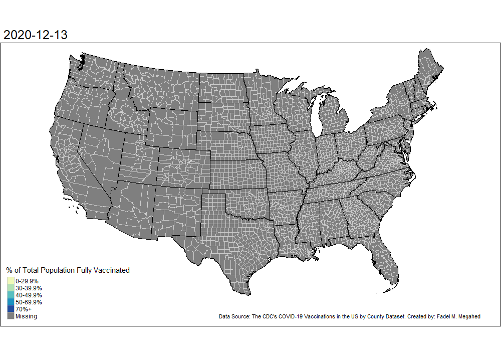

```{r setup, include=FALSE}
knitr::opts_chunk$set(cache = TRUE,
                      echo = TRUE,
                      warning = FALSE,
                      message = FALSE,
                      progress = FALSE, 
                      verbose = FALSE,
                      dev = c('png', 'pdf', 'tiff', 'postscript'),
                      fig.retina = 2,
                      out.width = '100%',
                      fig.asp = 0.7)

options(qwraps2_markup = "markdown")

# Setting properties for the default theme_bw() behavior for all plots
if(require(ggplot2) == FALSE) install.packages("ggplot2")
library(ggplot2) ; theme_set(theme_bw(base_size = 11) + theme(legend.position = 'top')) 

# Setting default color palettes to RColorBrewer Palettes
if(require(RColorBrewer) == FALSE) install.packages("RColorBrewer")
scale_colour_discrete = scale_color_brewer(palette = "Dark2")

# Setting the random seed and chunk dependencies
knitr::opts_chunk$set(cache.extra = set.seed(2021),
                      autodep = TRUE) 
knitr::dep_auto()

```


# R Setup and Required Packages
In this project, the open-source R programming language is used to model the progression in the COVID-19 pandemic in different U.S. counties. R is maintained by an international team of developers who make the language available at [The Comprehensive R Archive Network](https://cran.r-project.org/). Readers interested in reusing our code and reproducing our results should have R installed locally on their machines. R can be installed on a number of different operating systems (see [Windows](https://cran.r-project.org/bin/windows/), [Mac](https://cran.r-project.org/bin/macosx/), and [Linux](https://cran.r-project.org/bin/linux/) for the installation instructions for these systems). We also recommend using the RStudio interface for R. The reader can [download RStudio](http://www.rstudio.com/ide) for free by following the instructions at the link. For non-R users, we recommend the [Hands-on Programming with R](https://rstudio-education.github.io/hopr/packages.html) for a brief overview of the software's functionality. Hereafter, we assume that the reader has an introductory understanding of the R programming language.

In the code chunk below, we load the packages used to support our analysis. Note that the code of this and any of the code chunks can be hidden by clicking on the 'Hide' button to facilitate the navigation. **The reader can hide all code and/or download the Rmd file associated with this document by clicking on the Code button on the top right corner of this document.** Our input and output files can also be accessed/ downloaded from [fmegahed/vaccines](https://github.com/fmegahed/vaccines).


```{r packages, cache=FALSE}
# Check and install if these packages are not found locally on machine
if(require(pacman)==FALSE) install.packages("pacman")
if(require(devtools)==FALSE) install.packages("devtools")
if(require(urbnmapr)==FALSE) devtools::install_github('UrbanInstitute/urbnmapr')

pacman::p_load(tidyverse, magrittr, janitor, lubridate, hms, skimr, # data analysis packages
               DT, pander, stargazer, knitr, # for nicely printed outputs
               scales, DataExplorer, plotly, # for plots
               urbnmapr, tmap, sf, # for maps
               gifski, av) # for creating gif and videos
```


---

# The Vaccination Dataset

## Extracting the Dataset

The CDC has made available a dataset for [COVID-19 Vaccinations in the United States by County](https://data.cdc.gov/Vaccinations/COVID-19-Vaccinations-in-the-United-States-County/8xkx-amqh). Per the link's description, the dataset captures:  

> Overall US COVID-19 Vaccine administration data at county level. Data represents all vaccine partners including jurisdictional partner clinics, retail pharmacies, long-term care facilities, dialysis centers, Federal Emergency Management Agency and Health Resources and Services Administration partner sites, and federal entity facilities. 


We extracted the data using the code chunk below.

```{r vaccinesRaw, results='asis'}
csvLink = "https://data.cdc.gov/api/views/8xkx-amqh/rows.csv?accessType=DOWNLOAD"
rawVaccinesData = read_csv(csvLink)

vacCSVtime = Sys.time()

vaccines = rawVaccinesData %>% 
  # Removing unknown (UNK) and territories/states outside of continental US
  filter(!Recip_State %in% c('AK', 'AS', 'FM', 'GU', 'HI', 
                             'MH', 'MP', 'PR', 'PW', 'UNK', 'VI')) %>% 
  # Converting Date from Char to Date format
  mutate(Date = mdy(Date)) %>% 
  # Ascending order by FIPS and Date
  arrange(FIPS, Date) %>% 
  # Reducing the columns to those potentially relevant
  select(Date, FIPS, MMWR_week, Recip_County, Recip_State,
         Series_Complete_Pop_Pct, Completeness_pct) %>% 
  # Converting Char to Factor cols  
  mutate_if(is.character, as_factor)

# Explicitly saving the vaccines df
write_rds(vaccines, "../Data/vaccines.rds")

# Rounding the time of data extraction to nearest minute
paste0('The vaccines data were extracted on ',  
      format(vacCSVtime, '%B %d, %Y'), 
      ' at approximately ',
     round_hms(as_hms(vacCSVtime), digits = -2), '.')
```

## Exploring the Data {.tabset .tabset-fade .tabset-pills}


### MetaData Summary {-}

```{r vaccinesSkim}
skim(vaccines) 
```

### Latest Vaccination Map {-}

```{r latestVaccinesMap, class.source = 'fold-hide'}
# Getting the counties map from the urbnmapr package and excluding non-continental US
counties_sf = get_urbn_map(map = "counties", sf = TRUE) %>% 
  filter(!state_name %in% c('Alaska', 'Hawaii') )

# Getting the states map from the urbnmapr package and excluding non-continental US
states_sf = get_urbn_map(map = "states", sf = TRUE) %>% 
  filter(!state_name %in% c('Alaska', 'Hawaii') )

v_df = vaccines %>% 
  # Removing observations where the data is missing
  na.exclude(Date) %>% 
  # Keeping relevant columns
  select(Date, FIPS, Series_Complete_Pop_Pct, Completeness_pct) %>% 
  # Setting observations with completeness_pct = 0 to NA
  mutate(Series_Complete_Pop_Pct = na_if(Series_Complete_Pop_Pct, Completeness_pct == 0)) %>% 
  # Discretizing the Complete_Pop_Pct to match the CDC Plot
  # see https://covid.cdc.gov/covid-data-tracker/#county-view for the example
  mutate(Series_Complete_Pop_Pct_Disc = cut(Series_Complete_Pop_Pct,
                                            breaks = c(0, 29.9, 39.9, 49.9, 69.9, 100),
                                            labels = c('0-29.9%', '30-39.9%',
                                                       '40-49.9%', '50-69.9%', '70%+') ) )
# Merging the sf with the vaccines df
cty_sf_vac = left_join(counties_sf,
                       v_df,
                       by = c("county_fips" = "FIPS"))

# Creating the plot
cty_sf_vac %>% filter(Date == max(Date, na.rm = T) - 1) %>% 
  ggplot() +
  geom_sf(mapping = aes(fill = Series_Complete_Pop_Pct_Disc), color = "gray80", size = 0.15) +
  geom_sf(data = states_sf, fill = NA, color = "black", size = 0.5) +
  coord_sf(datum = NA) + 
  scale_fill_brewer(palette = 'YlGnBu', na.value = 'gray50', name = "% of Total Population Fully Vaccinated") +
  labs(title = paste("Percent of the Total Population Fully Vaccinated as of", max(v_df$Date, na.rm = T) - 1),
       caption = "Data Source: The CDC's COVID-19 Vaccinations in the US by County Dataset")


```


### Animated Vaccination Map {-}

```{r animatedMap, results = FALSE, class.source = 'fold-hide'}
# Capitalizing on the tmap package to animate the choropleth map

# Adjusting the bounding boxes for the map so that legend and credits print nicely
# Solution based on https://stackoverflow.com/a/60899644/10156153
bbox_new = st_bbox(counties_sf)

xrange = bbox_new$xmax - bbox_new$xmin # range of x values
yrange = bbox_new$ymax - bbox_new$ymin # range of y values
bbox_new[1] = bbox_new[1] - (0.1 * xrange) # xmin - left
bbox_new[3] = bbox_new[3] + (0.12 * xrange) # xmax - right
bbox_new[2] = bbox_new[2] - (0.1 * yrange) # ymin - bottom

bbox_new = bbox_new %>%  # take the bounding box ...
  st_as_sfc() # ... and make it a sf polygon


animatedMap = tm_shape(cty_sf_vac, bbox = bbox_new) +
  tm_borders(col = "gray80", lwd = 0.15) +
  tm_fill('Series_Complete_Pop_Pct_Disc', palette = "YlGnBu", colorNA = "gray50",
          title = "% of Total Population Fully Vaccinated") +
  tm_facets(along = "Date", free.coords = FALSE) +
  tm_shape(states_sf) + tm_borders(col = "black", lwd = 0.5) +
  tm_credits("Data Source: The CDC's COVID-19 Vaccinations in the US by County Dataset. Created by: Fadel M. Megahed \t")

tmap_animation(animatedMap, filename = "../Figures/animatedVaccineMap.gif", fps = 3,
               width = 1000, height = 700, outer.margins = 0)

tmap_animation(animatedMap, filename = "../Figures/animatedVaccineMap.mp4", fps = 3,
               width = 1000, height = 700, outer.margins = 0)
```





### Sample Counties' Time-Series Plot {-}

```{r tsPlot, class.source = 'fold-hide'}
# Excluding counties with no data on max Date from being potentially plotted
v_df %<>% filter(Date == max(Date, na.rm = T) & 
                !is.na(Series_Complete_Pop_Pct_Disc) )


sampleFIPs = sample(v_df$FIPS, size = 9, replace = F) %>% as.character()

vaccines_sample_df = vaccines %>% 
  # Removing observations where the data is missing
  na.exclude(Date) %>% 
  # filtering based on sampleFIPS
  filter(FIPS %in% sampleFIPs) %>% 
  # Creating a Proper Name for the Counties
  mutate(Full_County_name = paste(Recip_County, Recip_State, sep = ", "))


vaccines_sample_df %>% 
  ggplot(aes(x = Date, y = Series_Complete_Pop_Pct, color = Completeness_pct, group = Full_County_name)) + 
  facet_wrap(vars(Full_County_name)) +
  geom_line(size = 1) + 
  theme_bw() +
  theme(legend.position = "top") +
  scale_color_viridis_c(option = "viridis", direction = -1) +
  scale_x_date(breaks = pretty_breaks(n = 6)) +
  labs(y = '% of Total Population Fully Vaccinated',
       color = 'Data Completeness Percentage')
```

# References
<div id="refs"></div>


---


# Appendix
In this appendix, we print all the R packages used in our analysis and their versions to assist with reproducing our results/analysis.

```{r sessionInfo}
pander::pander(sessionInfo(), compact = TRUE) # printing the session info
```